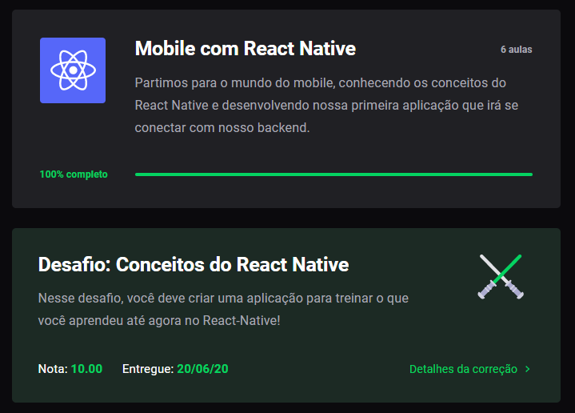
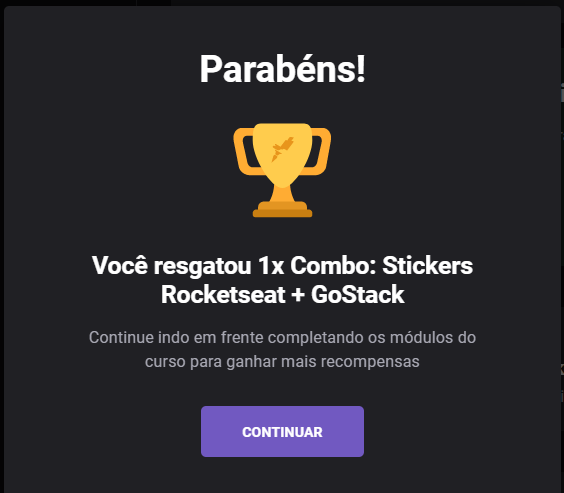

# Desafio 4: Bootcamp GoStack - Conceitos do React Native

<h3 align="center">
  Desafio 04: Conceitos do React Native
</h3>

<blockquote align="center">“Sucesso não é o resultado de um jogo, mas o destino de uma jornada”!</blockquote>

  

  </a>

  <a href="#rocket-sobre-o-desafio">Sobre o desafio</a>&nbsp;&nbsp;&nbsp;|&nbsp;&nbsp;&nbsp;
  <a href="#calendar-entrega">Entrega</a>&nbsp;&nbsp;&nbsp;|&nbsp;&nbsp;&nbsp;
  <a href="#memo-licença">Licença</a>

## :rocket: Sobre o desafio

Nesse desafio, foi criada uma aplicação para treinar o que aprendemos no React Native!

O objetivo é desenvolver a aplicação que irá armazenar repositórios do portfólio, que já desenvolvemos o backend utilizando o Node.js, e no último desafio em ReactJS.

### Template da aplicação

Para ajudar nesse desafio, foi criado um modelo para utilizar como um template do Github.

O template está disponível na seguinte url: **[Acessar Template](https://github.com/Rocketseat/gostack-template-conceitos-react-native)**

**Dica**: Caso não saiba utilizar repositórios do Github como template, deve-se seguir o guia em **[nosso FAQ](https://github.com/Rocketseat/bootcamp-gostack-desafios/tree/master/faq-desafios).**

Agora navegue até a pasta criada e abra no Visual Studio Code, execute o comando `yarn` no seu terminal para instalar todas as dependências e já estará pronto para iniciar.

**Atenção**: Caso você esteja emulando no iOS, na pasta do seu projeto navegue até a pasta ios executando o comando `cd ios` e depois execute `pod install` para instalar todas as dependências para o iOS.

### Funcionalidades da aplicação

Agora que o template foi clonado, devemos abrir o arquivo **src/App.js**, e completar onde não possui código com o código para atingir os objetivos de cada funcionalidade.

- **`Listar os repositórios da sua API`**: Deve ser capaz de criar uma lista de todos os repositórios que estão cadastrados na sua API com os campos **title**, **techs** e número de curtidas seguindo o padrão `${repository.likes} curtidas`, apenas alterando o número para ser dinâmico.

- **`Curtir um repositório listado da API`**: Deve ser capaz de curtir um item na sua API através de um botão com o texto **Curtir** e deve atualizar o número de likes na listagem no mobile.

### Específicação dos testes

Em cada teste, há uma breve descrição do que a aplicação deve cumprir para que o teste seja aprovado.

Caso surjam dúvidas quanto ao que são os testes, e como interpretá-los, acesse o link **[nosso FAQ](https://github.com/Rocketseat/bootcamp-gostack-desafios/tree/master/faq-desafios).**

Para esse desafio temos os seguintes testes:

- **`should add a like to the like counter of the repository`**: Para que esse teste passe, sua aplicação deve permitir ao clicar no botão `Curtir`, um like seja adicionado ao repositório listado, e que essa atualização possa ser visualizada na tela.

### Dificuldades encontradas no desafio:

A maior dificuldade encontrada neste desafio foi relacionado ao emulador do Android para Windows que apresentava vários erros, mesmo quando os testes eram aprovados.

## :calendar: Entrega

Esse desafio foi entregue a partir da plataforma Skylab. Após concluir o desafio, é aconselhável fazer um post no Linkedin e postar o código no Github como uma forma de demonstrar os conhecimentos e esforços para evoluir na carreira e/ou para oportunidades futuras.

Após envio, o componente do Desafio será atualizado com a nota e com a informação de aprovação, conforme abaixo:

  

 

Após finalizar, será liberado o prêmio relacionado ao Nível 1 do bootcamp:

  

 

## :memo: Licença

Esse projeto está sob a licença MIT. Veja o arquivo [LICENSE](LICENSE) para mais detalhes.

---

Feito com 💜 by RodrigoMonteiro :wave: [Entre na comunidade Discord!](https://discordapp.com/invite/gCRAFhc)
